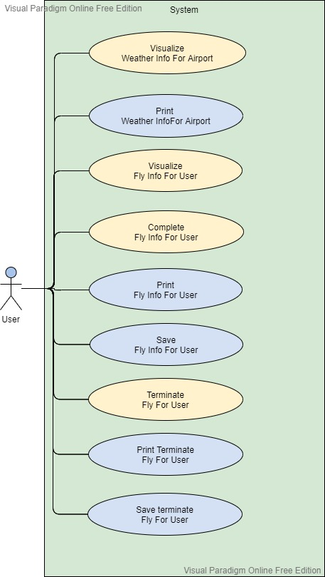
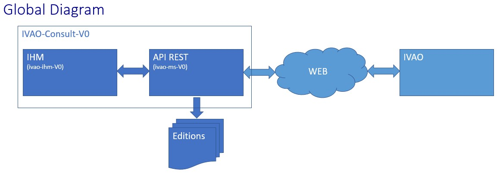
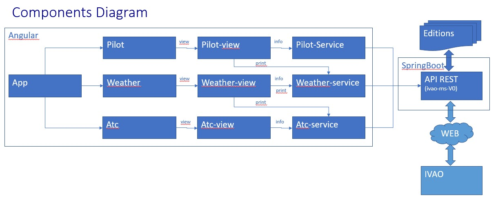
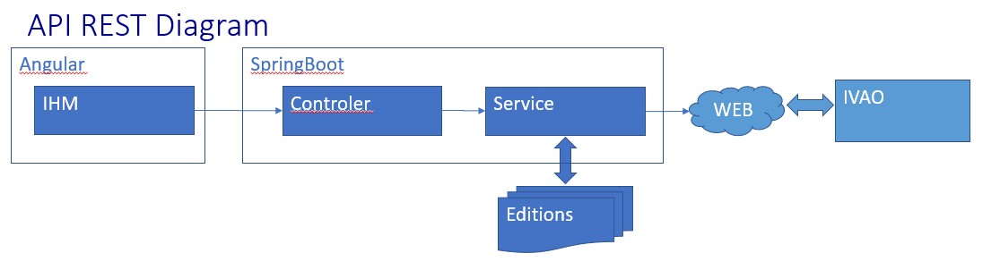

# IVAO CONSULT V0 - IvaoIhmV0

This project was generated with [Angular CLI](https://github.com/angular/angular-cli) version 11.0.2.

## Introduction
IVAO Consult is used to consult and print IVAO Weather, pilot and ATC informations from IVAO Web Site
* for Weather informations (observations and prévisions), airport id is required
* for Pilot informations, pilot user id is required. Those informations can be completed before printing
* for ATC informations, act user id is required.
After consultation, informations can be printed.

This part is IVAO Micro service (API REST - SprintBoot) project for IVAO CONSULT

### Use case Diagram

### Global Diagram

### Fonctional Diagram

### API REST Diagram

## prérequis
* java 11
* Maven
* port 8082 must be free. Else, change port on application.properties
* for IHM see https://github.com/E2lre/ivao-ihm-v0

## How to compile
In  root project directory execute command line : 
* mvn package

## How to excute
In root project directory execute command line : 
* cd target
* java -jar ivao-ms-v0-0.0.1-SNAPSHOT.jar

## API REST Documentation
All the document is on java dac.

### End Point catalog
* pilotInfoVID/{vid} (get)
Return pilot information for pilot user id
example : http://localhost:8082/pilotInfoVID/1234

* ATCInfoVID/{vid}
Return ATC information for ATC user id (get)
example : http://localhost:8082/ATCInfoVID/1234

* airportWeatherObs/{airportId} (get)
Return weather observation for airport ID
example : http://localhost:8082/airportWeatherObs/LFPG

* airportWeatherPrev/{airportId} (get)
Return weather prevision for airport ID
example : http://localhost:8082/airportWeatherPrev/LFPG

* printString/{info} (get)
Send string info to printer
example : http://localhost:8082/printString/HELLO-WORLD

* printString (post)
Send json body (somple string) to printer 
example : http://localhost:8082/printString

* testWazuup (get)
return whazuup example json
example : http://localhost:8082/testWazuup
